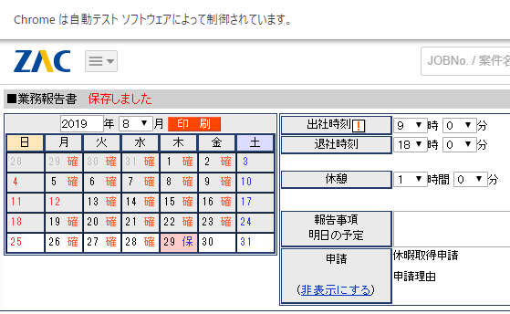

# これはなに
まいにちZakを開いて「出勤・退勤・休憩」を入力するのは面倒ですよね。  
コマンド一発で「出勤・退勤・休憩」を入力して保存してくれるソフトです。

# インストール
前提条件として nodejs >= 8 が必要です。

```
git clone https://github.com/ISLdekura/puppeteer_zak.git
node install
echo "USER_NAME=YOUR_USER_NAME" > .env
echo "USER_SECRET=YOUR_PASSWORD" >> .env
echo "HOUR_START=9" >> .env
echo "HOUR_END=18" >> .env
```

# 実行
```
node .\auto-input.js
```
出勤・退勤・休憩が自動入力されます。  
  
あとは作業ごとの時間を入れて確定するだけです。